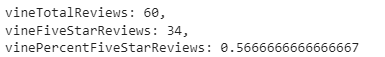
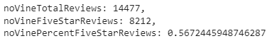

# RBCModule16-Challenge

## Overview of Analysis

The purpose of this analysis is to exemplfiy ETL proceedures for Amazon product reviews via AWS RDS data service, PostGresSQL, Pg4Admin and GoogleColab software. We pull an Amazon Reviews dataset and load it into Postgres tables hosted on AWS servers via PySpark. Then loading our data again into GoogleColab via PySpark, we manipulate the data to determine if the paid Amazon Vine reviews constitute some bias of reviewing.

## Results

We chose to examine reviews of Musical Instruments purchased from Amazon.com. Our results are summarized in the following two images. For more detailed results, please refer to the GoogleColab notebook [Vine Analysis](Vine_Review_Analysis.ipynb).

From our images, we can see that:

- We had only 60 paid Vine reviews versus our 14,477 non-Vine reviews.
- 34 of the Vine reviews were 5-star whereas 8212 of our non-Vine reviews were 5-star.
- These values constitute 56.66% and 56.72% of our total reviews respectively meaning there was no noticible bias by the paid-for nature of the vine reviews.

## Summary

As shown above, we could not determine any bias in positivity by the paid-for nature of the Vine review program. This being said, the category of Musical Instruments, product-wise, did not seem to have many Vine reviews in general though we may have excluded many by filtering out reviews that had fewer than 20 votes.

For further analysis, we should examine the standard deviation of the Vine reviews versus the non-Vine reviews to see if there is more of a skew there as well as examine the number of 1-star reviews as we may hypothesize that paid reviews are unlikely to be 1-star. We should also examine other product categories to see if there were more paid reviews for other product types which may skew those datasets overall. 